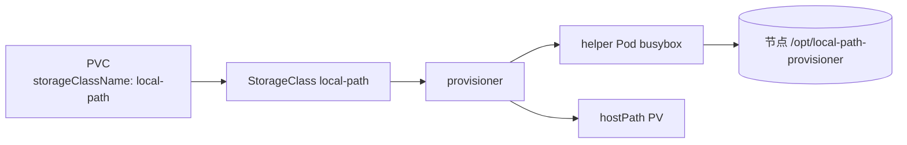

# local-path-provisioner

   [](https://github.com/neondatabase/helm-charts/actions/workflows/lint-test.yaml)

基于节点本地磁盘的动态 StorageClass（Rancher local-path-provisioner），供 Neon pageserver / safekeeper 等有状态组件以 PVC 方式申请本地存储。

**Homepage:** https://github.com/rancher/local-path-provisioner

## Source Code

* <https://github.com/rancher/local-path-provisioner>

## 简介

local-path-provisioner 利用节点的本地磁盘提供动态卷供给：当 PVC 引用本 chart 创建的 StorageClass 时，provisioner 会在 PVC 所属 Pod 被调度到的节点上创建目录（helper Pod 执行 `setup` 脚本），并生成指向该目录的 hostPath 类型 PV。

本 chart 等价于上游 `deploy/local-path-storage.yaml`（v0.0.36），并做了完整参数化：

- 默认**不设为集群默认 StorageClass**，Neon 组件通过 `storageClassName: local-path` 显式引用，避免影响集群内其他组件
- 卷目录默认落在宿主机 `/opt/local-path-provisioner`，节点路径映射、建卷/删卷脚本、helper Pod 均可配置
- 镜像（provisioner 与 helper 的 busybox）可覆盖，适配私有 registry


## 架构要点

| 资源 | 说明 |
|------|------|
| Deployment | 运行 provisioner（单副本，上游 v0.0.36 未启用 leader election） |
| ConfigMap | `config.json`（节点路径映射）、`setup`、`teardown`、`helperPod.yaml` |
| ServiceAccount | 运行时身份标识 |
| ClusterRole / ClusterRoleBinding | 集群级：nodes / pvc / pv / events / storageclasses |
| Role / RoleBinding | 命名空间内：helper Pod 的增删改查 |
| StorageClass | `rancher.io/local-path`，`WaitForFirstConsumer` |
| Namespace（可选） | 默认不创建，跟随 release 命名空间；`namespace.create=true` 时创建 `local-path-storage` |

供给流程：



## 安装

独立部署（默认部署到当前命名空间）：

```console
$ helm repo add neondatabase https://neondatabase.github.io/helm-charts
$ helm install local-path-provisioner neondatabase/local-path-provisioner
```

与上游保持一致、部署到独立命名空间 `local-path-storage`：

```console
$ helm install local-path-provisioner ./charts/local-path-provisioner \
    --set namespace.create=true
```

作为 Neon umbrella 的可选子 chart（默认关闭）：

```console
$ helm install neon ./charts/neon \
    --set local-path-provisioner.enabled=true \
    --set neon-pageserver.statefulSet.storage.storageClassName=local-path \
    --set neon-safekeeper.statefulSet.storage.storageClassName=local-path
```

自定义节点路径映射（结构较复杂，建议用 values 文件或 `--set-json`，避免 `--set` 索引语法覆盖整项）：

```console
$ helm install local-path-provisioner ./charts/local-path-provisioner \
    --set-json 'config.nodePathMap=[{"node":"node1","paths":["/data/neon"]},{"node":"DEFAULT_PATH_FOR_NON_LISTED_NODES","paths":["/opt/local-path-provisioner"]}]'
```

私有 registry 场景（与 `docs/image.md` 的镜像导入保持一致）：

```console
$ helm install local-path-provisioner ./charts/local-path-provisioner \
    --set image.repository=192.168.232.128:5000/neondatabase/local-path-provisioner \
    --set config.helperImage.repository=192.168.232.128:5000/neondatabase/busybox
```

### 与集群内置 StorageClass 冲突

k3s / kind 等发行版已内置同名 `local-path` StorageClass。此时请二选一：

```console
# 方式一：不创建 SC，复用集群内置的
$ helm install local-path-provisioner ./charts/local-path-provisioner --set storageClass.create=false

# 方式二：改名部署
$ helm install local-path-provisioner ./charts/local-path-provisioner --set storageClass.name=neon-local-path
```

## 卸载

```console
$ helm uninstall local-path-provisioner
```

> 卸载不会清理已供给的 hostPath 目录与其中数据；`reclaimPolicy=Delete` 仅在删除 PVC 时触发 `teardown`。

## Requirements

Kubernetes: `^1.18.x-x`

## Values

| Key | Type | Default | Description |
|-----|------|---------|-------------|
| affinity | object | `{}` | 亲和性 |
| config.helperImage.pullPolicy | string | `"IfNotPresent"` | helper Pod 镜像拉取策略 |
| config.helperImage.repository | string | `"busybox"` | helper Pod 镜像仓库（私有仓库需覆盖） |
| config.helperImage.tag | string | `"1.35.0"` | helper Pod 镜像 tag |
| config.helperPod | string | 上游 helperPod.yaml（busybox，容忍 disk-pressure） | helper Pod 模板，支持 Go template |
| config.nodePathMap | list | `[{"node":"DEFAULT_PATH_FOR_NON_LISTED_NODES","paths":["/opt/local-path-provisioner"]}]` | 节点 → 宿主机路径映射 |
| config.setup | string | `mkdir -m 0777 -p "$VOL_DIR"` | 建卷脚本（helper Pod 执行） |
| config.teardown | string | `rm -rf "$VOL_DIR"` | 删卷脚本（PV 回收时执行） |
| debug | bool | `false` | 是否给 provisioner 追加 `--debug` |
| extraManifests | list | `[]` | 额外创建的 K8s 清单 |
| fullnameOverride | string | `""` | 完全覆盖 fullname 模板 |
| global | object | `{}` | 全局配置（umbrella 化时由父 chart global 值覆盖） |
| image.pullPolicy | string | `"IfNotPresent"` | 镜像拉取策略 |
| image.repository | string | `"rancher/local-path-provisioner"` | provisioner 镜像仓库 |
| image.tag | string | `"v0.0.36"` | 镜像 tag（对齐上游 release） |
| imagePullSecrets | list | `[]` | docker-registry secret 列表 |
| nameOverride | string | `""` | 部分覆盖 fullname 模板 |
| namespace.create | bool | `false` | 是否创建独立命名空间（默认跟随 release 命名空间） |
| namespace.name | string | `"local-path-storage"` | 独立命名空间名称 |
| nodeSelector | object | `{}` | 节点选择 |
| podAnnotations | object | `{}` | Pod 注解 |
| podLabels | object | `{}` | Pod 额外标签 |
| podSecurityContext | object | `{}` | Pod 安全上下文 |
| priorityClassName | string | `""` | Pod 优先级类 |
| resources.limits.cpu | string | `"200m"` | CPU 上限 |
| resources.limits.memory | string | `"256Mi"` | 内存上限 |
| resources.requests.cpu | string | `"50m"` | CPU 请求 |
| resources.requests.memory | string | `"64Mi"` | 内存请求 |
| securityContext | object | `{}` | 容器安全上下文 |
| serviceAccount.annotations | object | `{}` | SA 注解 |
| serviceAccount.create | bool | `true` | 是否创建 ServiceAccount（名称固定为 local-path-provisioner-service-account，不可配置） |
| storageClass.annotations | object | `{}` | StorageClass 附加注解 |
| storageClass.create | bool | `true` | 是否创建 StorageClass |
| storageClass.name | string | `"local-path"` | StorageClass 名称 |
| storageClass.reclaimPolicy | string | `"Delete"` | PV 回收策略 |
| tolerations | list | `[]` | 容忍 |

----------------------------------------------
Autogenerated from chart metadata using [helm-docs v1.9.1](https://github.com/norwoodj/helm-docs/releases/v1.9.1)
